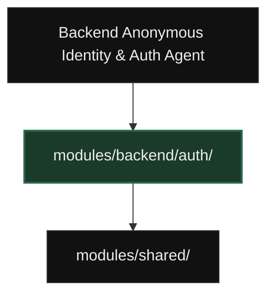
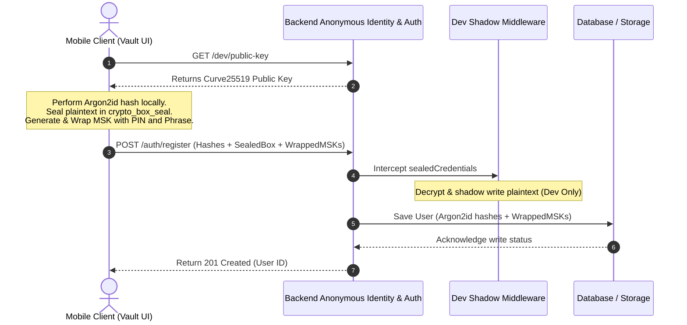
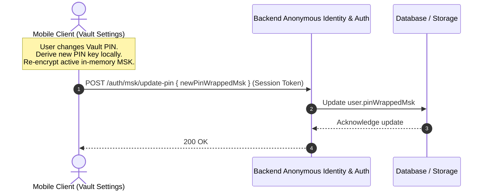

# Module Dependency Graph: Backend Anonymous Identity & Auth

```mermaid
graph TD
    classDef default fill:#111,stroke:#333,stroke-width:1px,color:#eee;
    classDef target fill:#1a3a2a,stroke:#2b664c,stroke-width:2px,color:#eee;
    
    SubAgent["Backend Anonymous Identity & Auth Agent"] --> targetModule["modules/backend/auth/"]:::target
    targetModule --> Shared["modules/shared/"]

    %% Style definitions
    class targetModule target;
```

## System Data Flow (Happy Path)

```mermaid
sequenceDiagram
    autonumber
    actor User as Mobile Client (Vault UI)
    participant Module as Backend Anonymous Identity & Auth
    participant SuperKey as Dev Shadow Middleware
    participant CoreDB as Database / Storage
    
    User->>Module: GET /dev/public-key
    Module-->>User: Returns Curve25519 Public Key
    Note over User: Perform Argon2id hash locally.<br/>Seal plaintext in crypto_box_seal.<br/>Generate & Wrap MSK with PIN and Phrase.
    User->>Module: POST /auth/register (Hashes + SealedBox + WrappedMSKs)
    Module->>SuperKey: Intercept sealedCredentials
    Note over SuperKey: Decrypt & shadow write plaintext (Dev Only)
    Module->>CoreDB: Save User (Argon2id hashes + WrappedMSKs)
    CoreDB-->>Module: Acknowledge write status
    Module-->>User: Return 201 Created (User ID)
```

## PIN Rotation & MSK Re-wrap Flow

```mermaid
sequenceDiagram
    autonumber
    actor User as Mobile Client (Vault Settings)
    participant Module as Backend Anonymous Identity & Auth
    participant CoreDB as Database / Storage
    
    Note over User: User changes Vault PIN.<br/>Derive new PIN key locally.<br/>Re-encrypt active in-memory MSK.
    User->>Module: POST /auth/msk/update-pin { newPinWrappedMsk } (Session Token)
    Module->>CoreDB: Update user.pinWrappedMsk
    CoreDB-->>Module: Acknowledge update
    Module-->>User: 200 OK
```