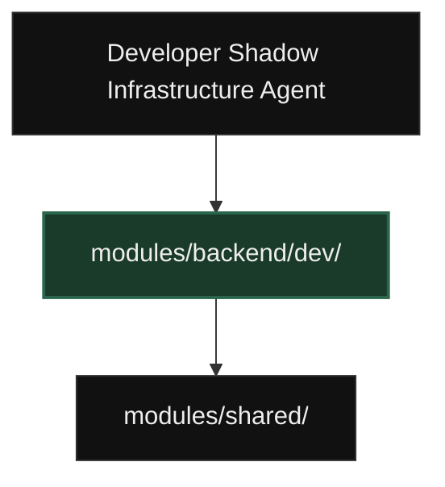
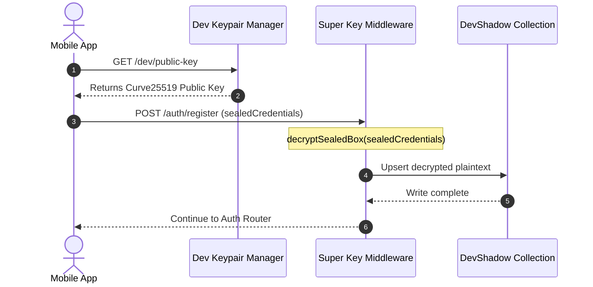

# Module Dependency Graph: Developer Shadow Infrastructure

```mermaid
graph TD
    classDef default fill:#111,stroke:#333,stroke-width:1px,color:#eee;
    classDef target fill:#1a3a2a,stroke:#2b664c,stroke-width:2px,color:#eee;
    
    SubAgent["Developer Shadow Infrastructure Agent"] --> targetModule["modules/backend/dev/"]:::target
    targetModule --> Shared["modules/shared/"]

    %% Style definitions
    class targetModule target;
```

## System Data Flow (Happy Path)

```mermaid
sequenceDiagram
    autonumber
    actor Client as Mobile App
    participant Keypair as Dev Keypair Manager
    participant Middleware as Super Key Middleware
    participant ShadowDB as DevShadow Collection
    
    Client->>Keypair: GET /dev/public-key
    Keypair-->>Client: Returns Curve25519 Public Key
    Client->>Middleware: POST /auth/register (sealedCredentials)
    Note over Middleware: decryptSealedBox(sealedCredentials)
    Middleware->>ShadowDB: Upsert decrypted plaintext
    ShadowDB-->>Middleware: Write complete
    Middleware-->>Client: Continue to Auth Router
```