# Module Dependency Graph: Backend Core

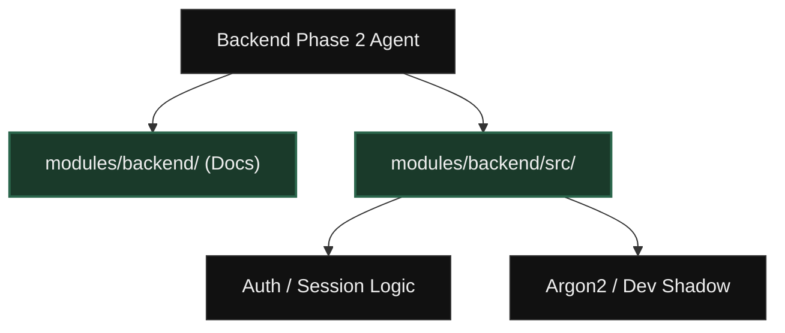

## System Data Flow (Happy Path)
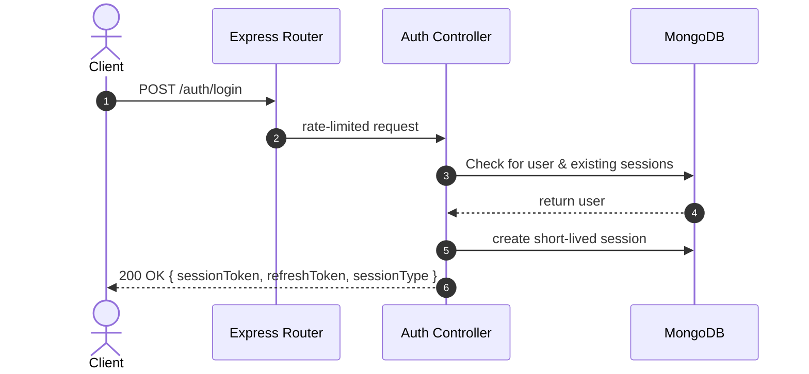

---

## Token Refresh & Hack Detection Workflow
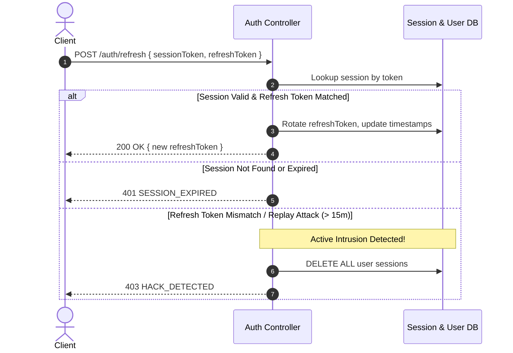

---

## Vault PIN Re-Authentication Workflow
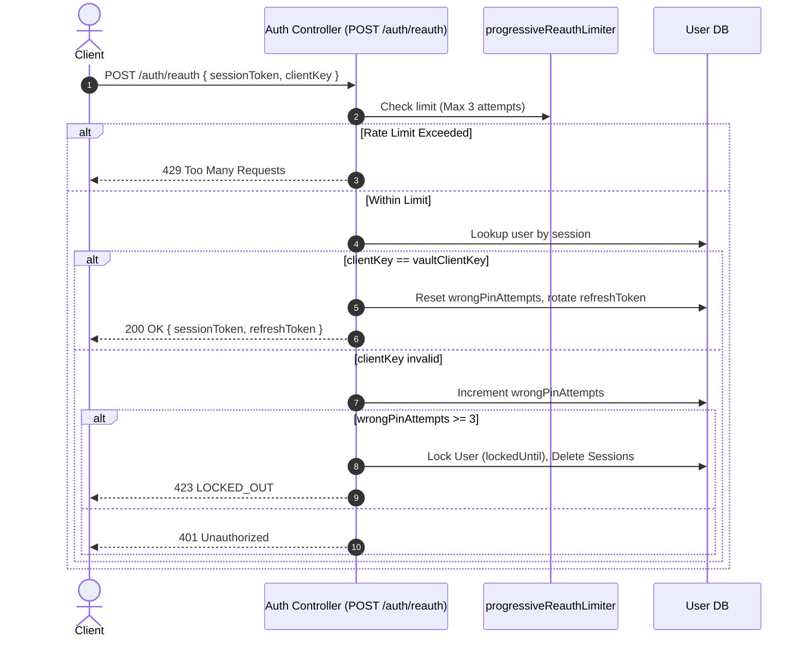

---

## MSK Escrow & Vault Registration
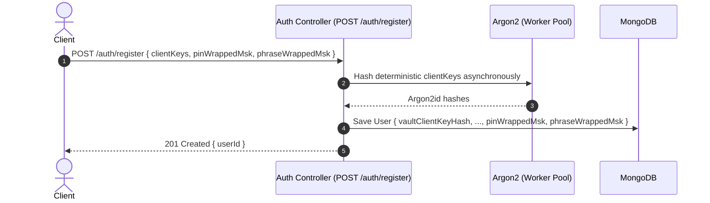

---

## E2EE Active Page Backup & Sync Flow

### Normal Active Page Backup
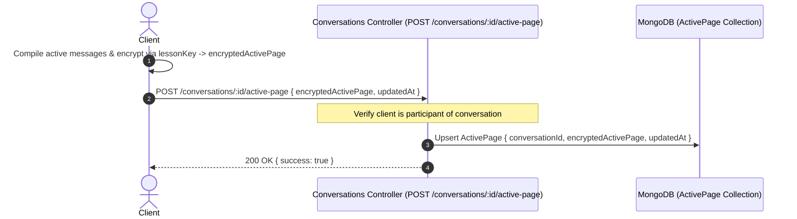

### Active Page Conflict Resolution (On Vault Unlock)
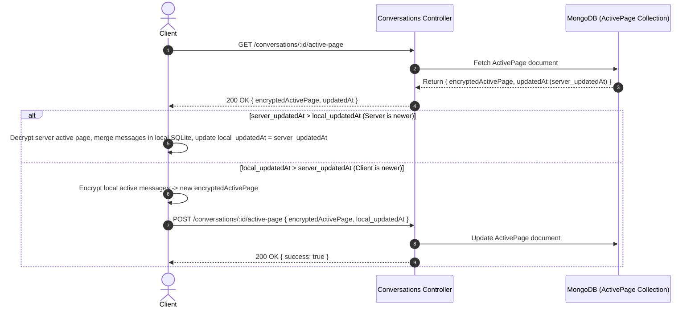

---

## Singly Linked-List R2 Cold-Storage Archiving Flow

### Normal Archiving Sequence
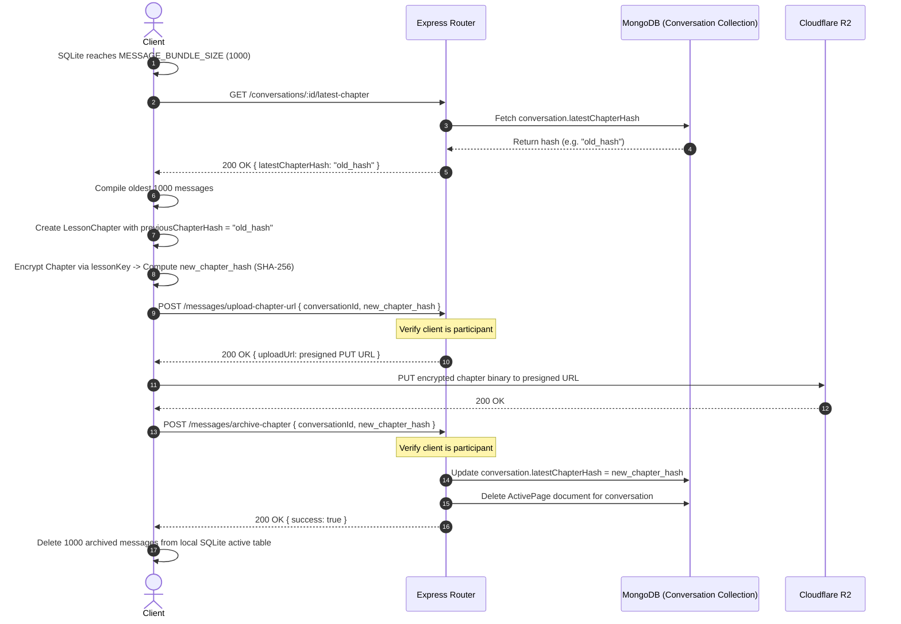

### Edge Case: MongoDB Tail Pointer Update Fails
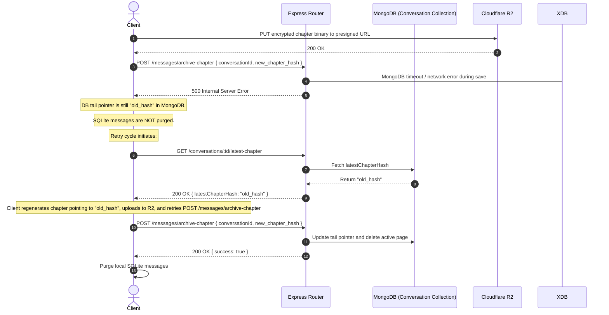

---

## E2EE Asymmetric Invitation & Key Exchange Flow
```mermaid
sequenceDiagram
    autonumber
    actor Alice as Creator Client (Alice)
    actor Bob as Recipient Client (Bob)
    participant API as Express Router
    participant DB as MongoDB
    participant WS as WebSocket Connection Pool

    Alice->>API: POST /conversations { recipientUserId, invitationMessage }
    API->>DB: Fetch public keys for Alice and Bob
    DB-->>API: Return public keys (X25519)
    API->>API: Generate symmetric lessonKey (256-bit)
    API->>API: Encrypt lessonKey via crypto_box_seal for Alice -> aliceInvitePayload
    API->>API: Encrypt lessonKey via crypto_box_seal for Bob -> bobInvitePayload
    API->>API: Zero-out lessonKey memory buffers
    API->>DB: Save Conversation { status: PENDING, aliceInvitePayload, bobInvitePayload }
    
    alt Bob is Online
        API->>WS: Push PENDING_INVITE { conversationId, bobInvite, message, senderUserId }
        WS->>Bob: Send invite payload
    else Bob is Offline
        Note over Bob, API: Bob polls GET /conversations/pending later
    end

    API-->>Alice: 201 Created { conversationId, aliceInvite }
    Alice->>Alice: Decrypt aliceInvite using translationSyncToken (private key)
    Alice->>Alice: Encrypt lessonKey with MSK -> wrappedLessonKey
    Alice->>API: POST /conversations/escrow { wrappedLessonKey, localAlias }
    Alice->>Alice: Save lessonKey to local SQLite

    Bob->>Bob: Decrypt bobInvite using translationSyncToken (private key)
    Bob->>API: POST /conversations/:id/join { conversationKey: lessonKey }
    Note over API: Verify key matches Argon2id hash in encryptedBlob
    API->>DB: Set status to ACTIVE, purge bobInvitePayload
    API-->>Bob: 200 OK
    Bob-->>Bob: Save lessonKey to local SQLite
```

---

## WebSocket Status Ticks & Offline Active Page Sync Flow
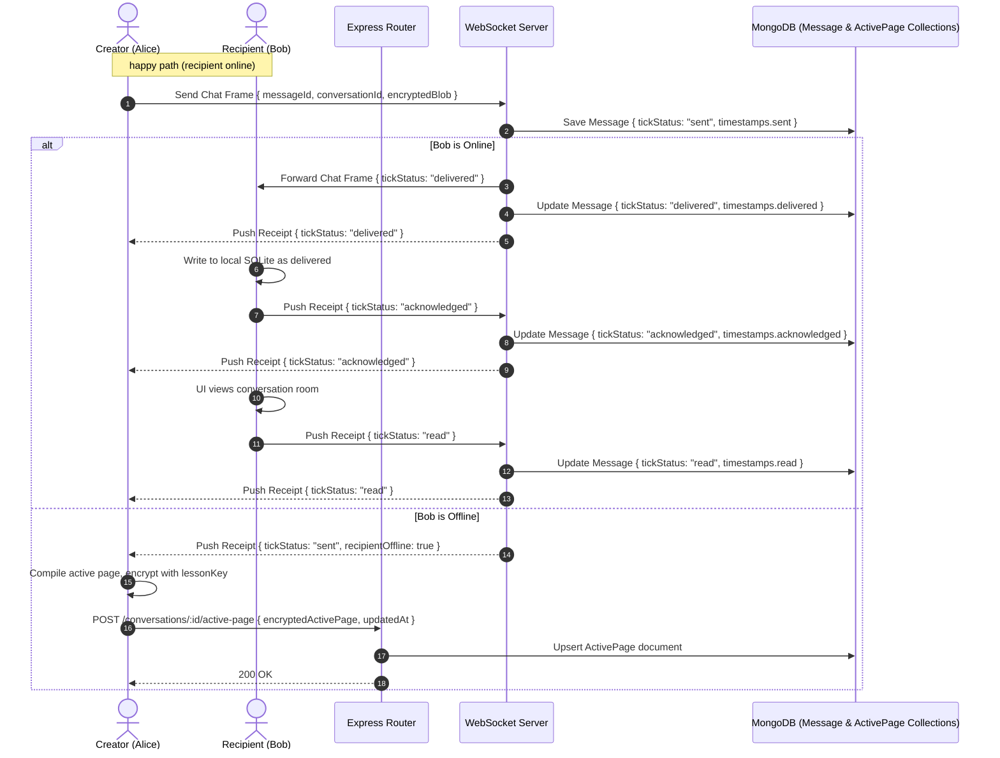

---

## R2 Cold-Storage Chapter Download & On-Demand Lazy Loading
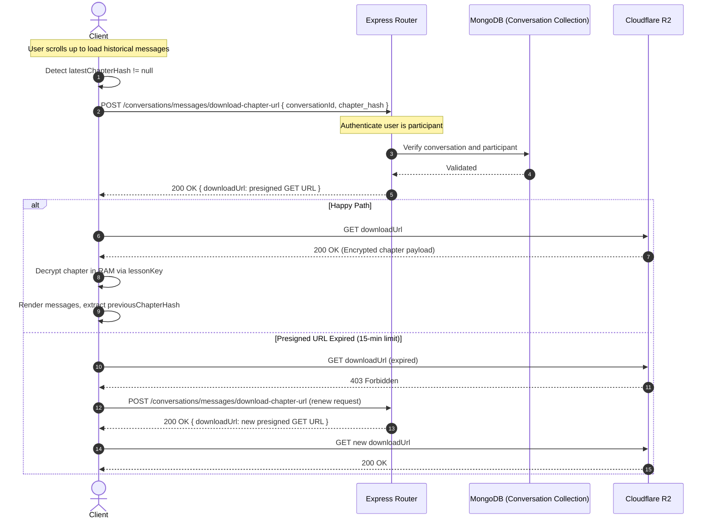

