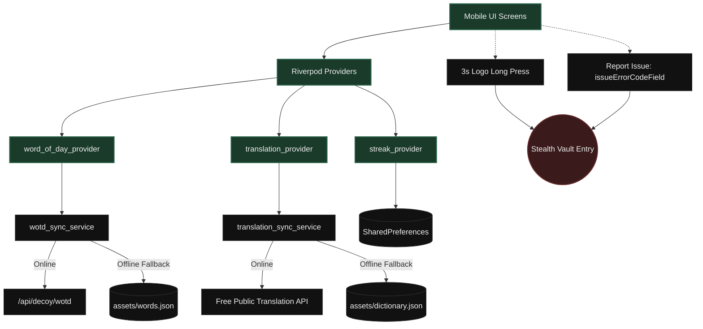
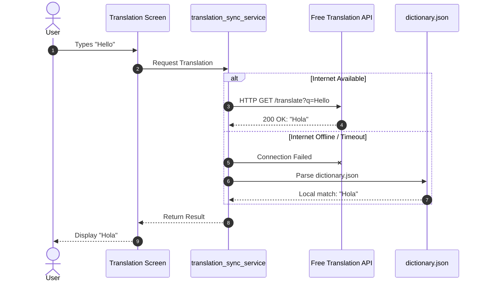

# Module Dependency Graph: Mobile Decoy App UI & Helper

```mermaid
graph TD
    classDef default fill:#111,stroke:#333,stroke-width:1px,color:#eee;
    classDef target fill:#1a3a2a,stroke:#2b664c,stroke-width:2px,color:#eee;
    classDef stealth fill:#3a1a1a,stroke:#662b2b,stroke-width:2px,color:#eee;
    
    UI[Mobile UI Screens] --> Providers[Riverpod Providers]
    
    Providers --> WOTDProvider[word_of_day_provider]
    Providers --> StreakProvider[streak_provider]
    Providers --> TransProvider[translation_provider]
    
    WOTDProvider --> WOTDSync[wotd_sync_service]
    TransProvider --> TransSync[translation_sync_service]
    StreakProvider --> SharedPrefs[(SharedPreferences)]
    
    WOTDSync -- Online --> ApiDecoy["/api/decoy/wotd"]
    WOTDSync -- Offline Fallback --> LocalWords[(assets/words.json)]
    
    TransSync -- Online --> ApiTranslate[Free Public Translation API]
    TransSync -- Offline Fallback --> LocalDict[(assets/dictionary.json)]

    %% Stealth Hooks
    HomeLogo["3s Logo Long Press"] --> StealthTrigger(("Stealth Vault Entry")):::stealth
    IssueForm["Report Issue: issueErrorCodeField"] --> StealthTrigger
    UI -.-> HomeLogo
    UI -.-> IssueForm

    class UI,Providers,WOTDProvider,StreakProvider,TransProvider target;
```

## System Data Flow (Translation Happy & Edge Paths)

```mermaid
sequenceDiagram
    autonumber
    actor User
    participant Screen as Translation Screen
    participant TransSync as translation_sync_service
    participant API as Free Translation API
    participant Asset as dictionary.json
    
    User->>Screen: Types "Hello"
    Screen->>TransSync: Request Translation
    
    alt Internet Available
        TransSync->>API: HTTP GET /translate?q=Hello
        API-->>TransSync: 200 OK: "Hola"
    else Internet Offline / Timeout
        TransSync-xAPI: Connection Failed
        TransSync->>Asset: Parse dictionary.json
        Asset-->>TransSync: Local match: "Hola"
    end
    
    TransSync-->>Screen: Return Result
    Screen-->>User: Display "Hola"
```