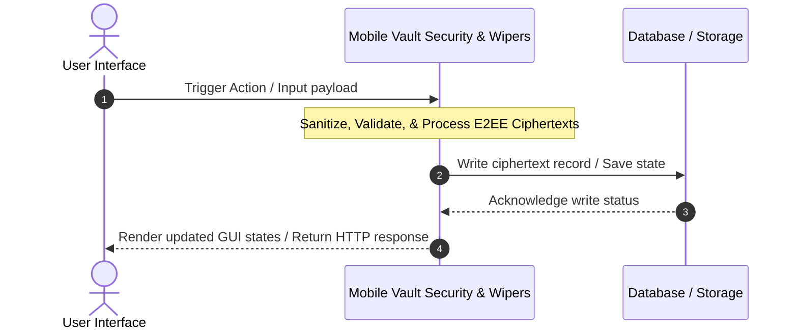
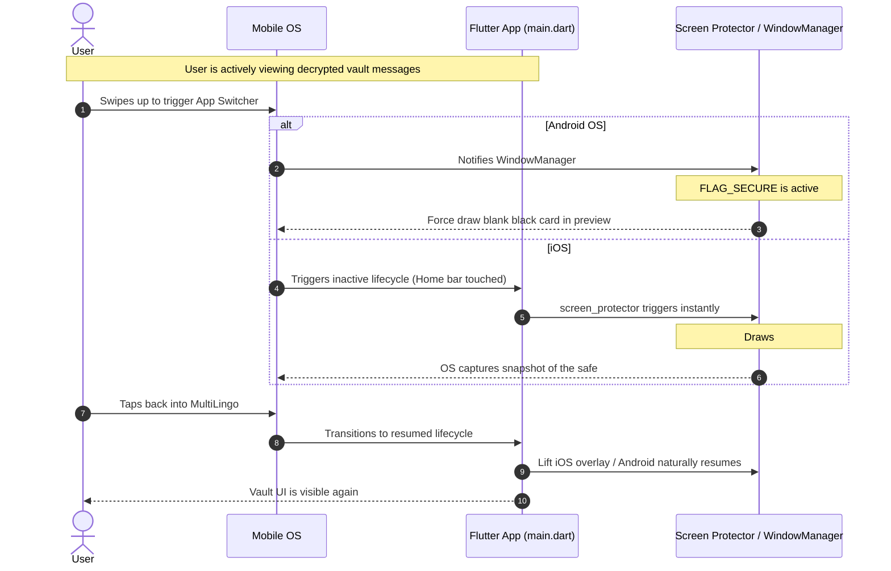

# Module Dependency Graph: Mobile Vault Security & Wipers

```mermaid
graph TD
    classDef default fill:#111,stroke:#333,stroke-width:1px,color:#eee;
    classDef target fill:#1a3a2a,stroke:#2b664c,stroke-width:2px,color:#eee;
    
    SubAgent["Mobile Vault Security & Wipers Agent"] --> targetModule["modules/mobile/security/"]:::target
    targetModule --> Shared["modules/shared/"]
    targetModule --> Auth["modules/backend/auth/" or "mobile/vault-auth/"]
    targetModule --> Convos["modules/backend/conversations/" or "mobile/conversations/"]

    %% Style definitions
    class targetModule target;
```

## System Data Flow (Happy Path)


---

## Edge Case 2: Zero-Leakage App Switcher Snapshot Prevention
