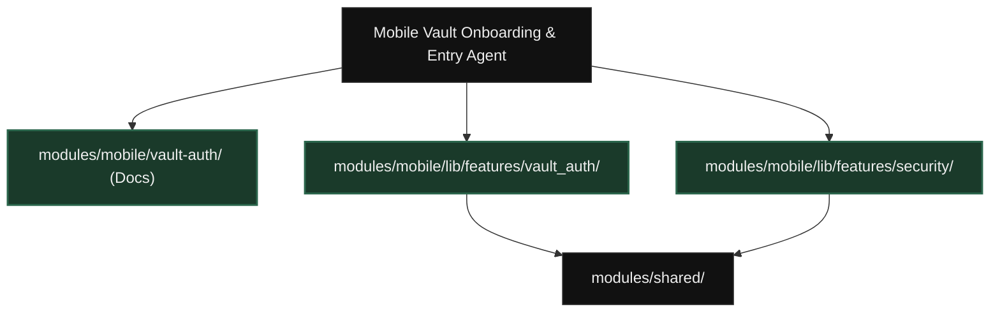
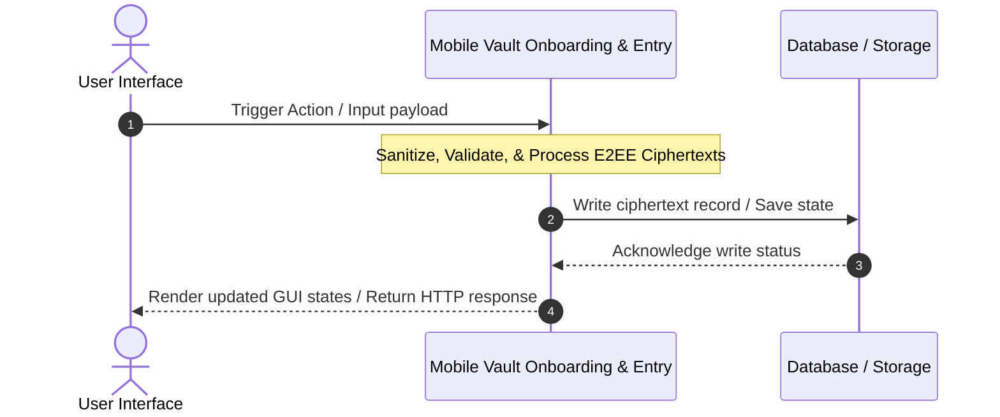
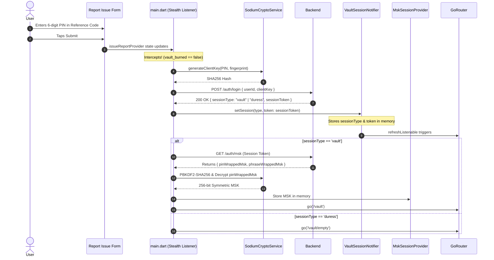
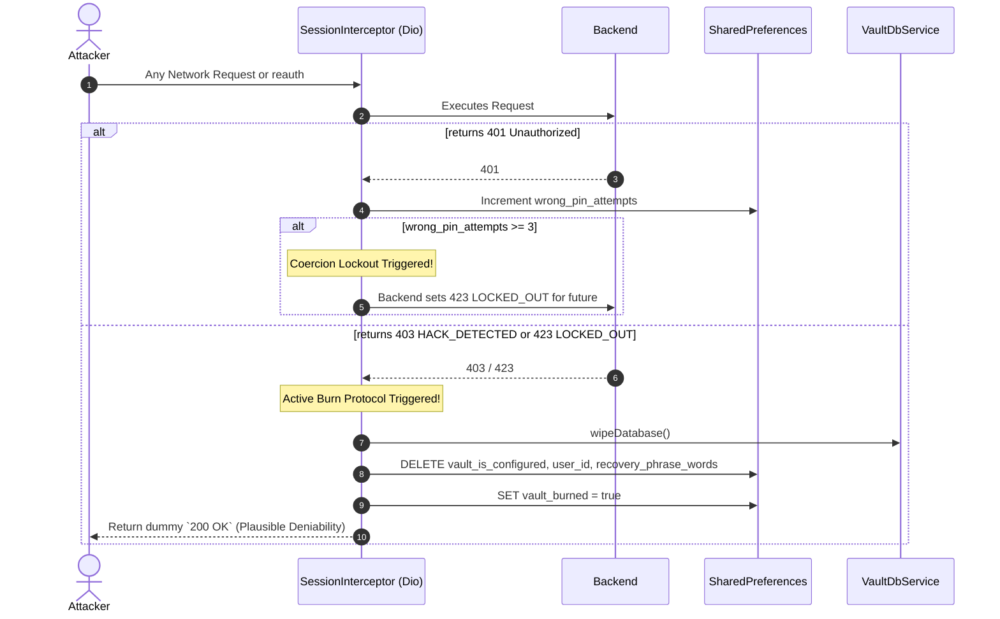
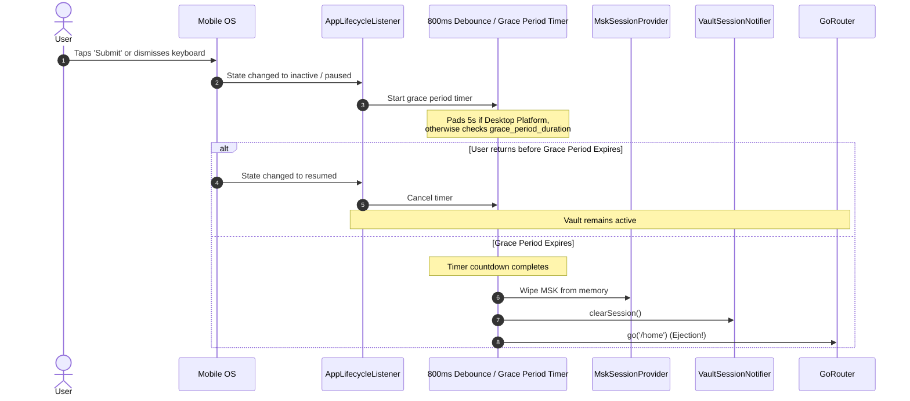
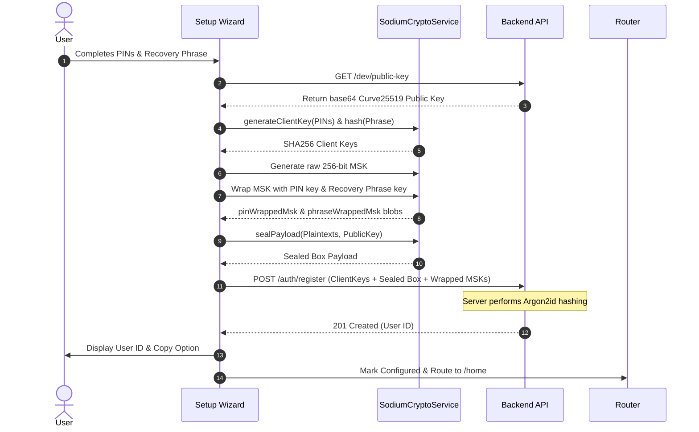
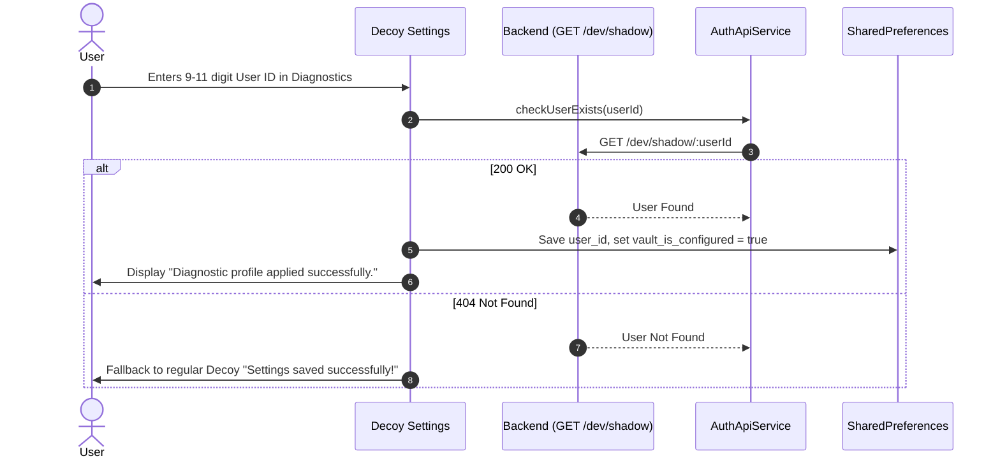
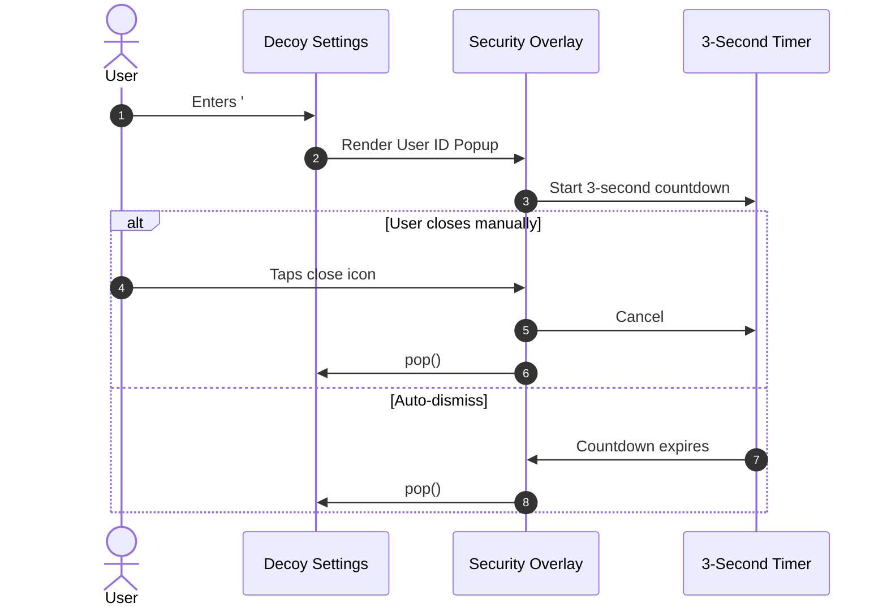

# Module Dependency Graph: Mobile Vault Onboarding & Entry

## System Data Flow (Happy Path)

---

## Phase 1.4 Unified Vault Entry & MSK Recovery

---

## The Active Burn Protocol (Coercion Lockout & Hack Detection)

---

## Edge Case 1: Keyboard Dismissal vs. Background Ejection

---

## Vault Setup Wizard & API Registration (Phase 1.3 / Phase 2 MSK Escrow)

---

## Covert Identity Restoration (Device Migration)

---

## Active ID Covert Query
