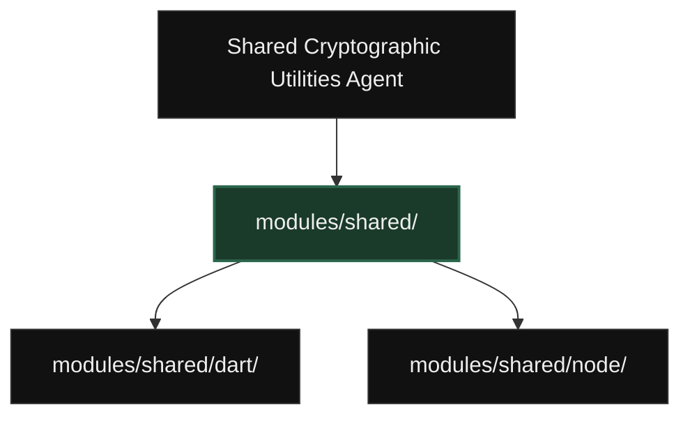
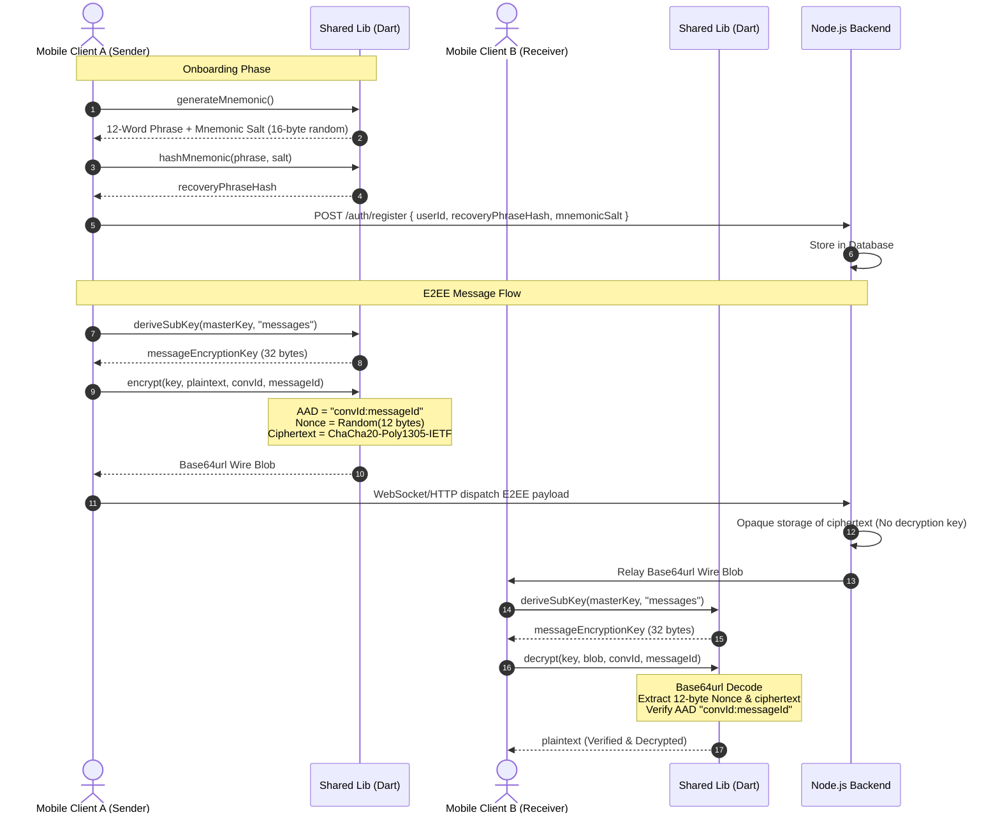
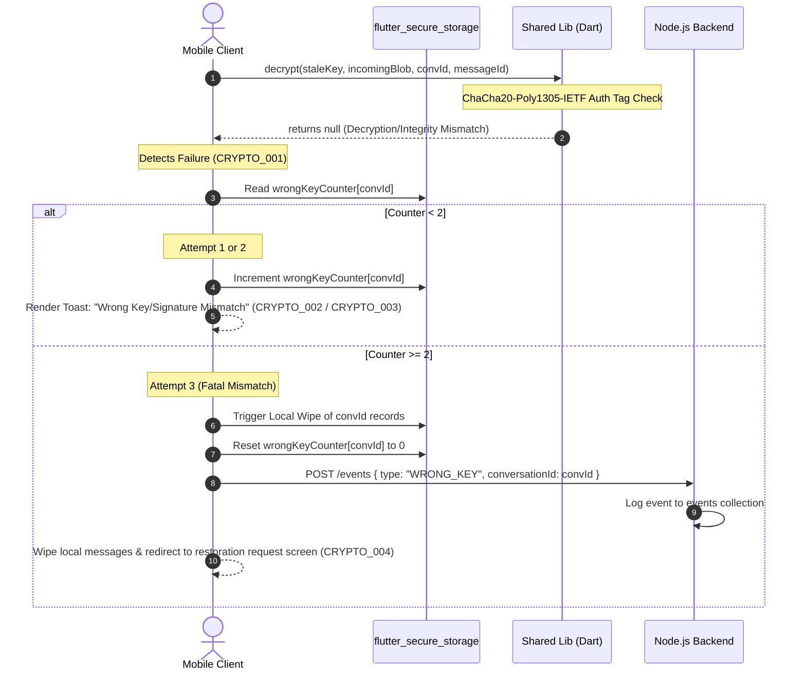
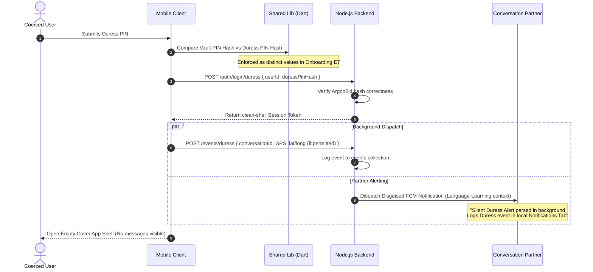

# Module Dependency Graph: Shared Cryptographic & Core Utilities

---

## 1. Normal Cryptographic Duality (Setup, Encryption, Decryption)

This sequence diagram illustrates the lifecycle of identity setup, room registration, message encryption, transport, and remote decryption.

---

## 2. Edge Case E11 — Wrong Key Wiping Flow

This diagram documents the error propagation and localized data destruction flow when a user attempts to decrypt with an incorrect or stale key (e.g. after a key rotation mismatch).

---

## 3. Duress PIN Activation Flow

This diagram illustrates the stealth execution triggered by entering the Duress PIN instead of the Vault PIN. The UI displays a seemingly empty vault shell, while cryptographically executing background notifications.

