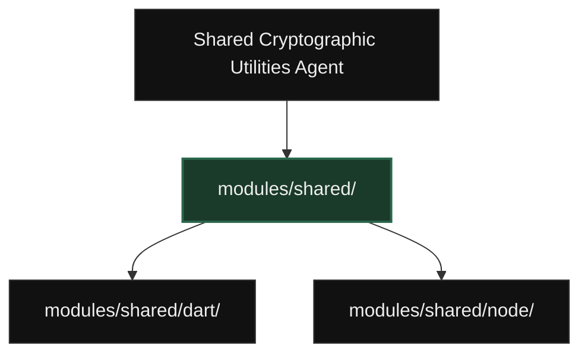
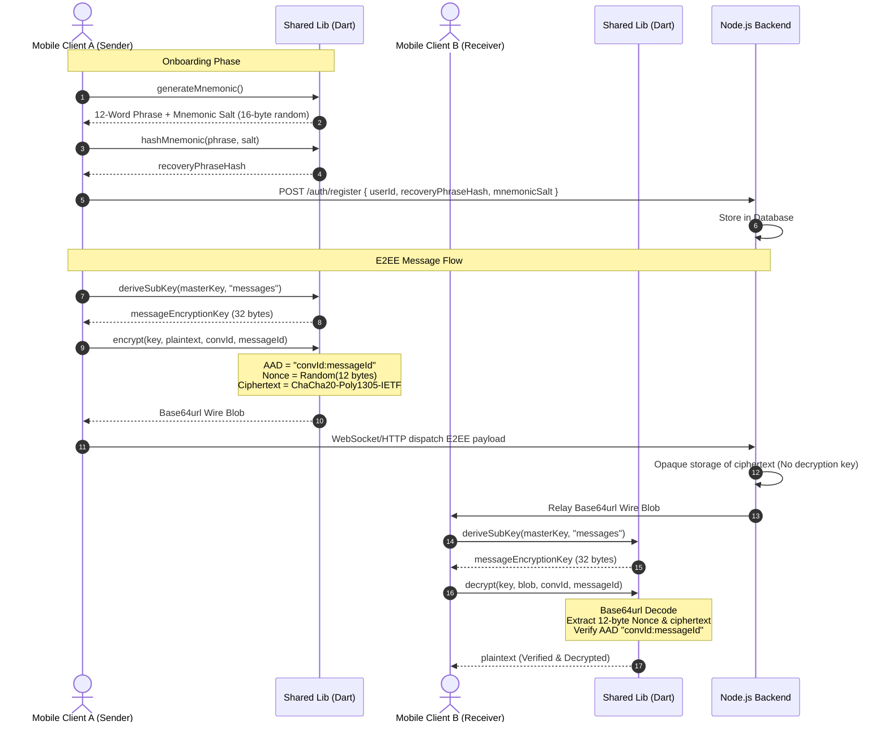
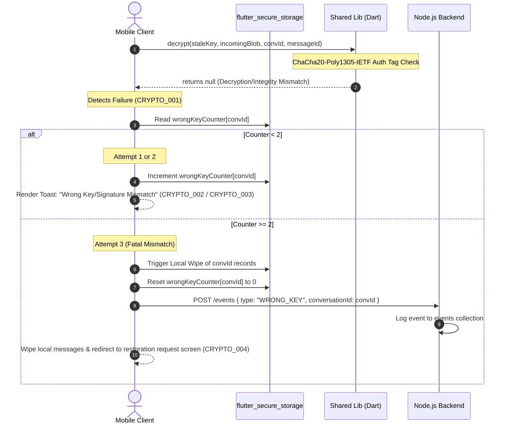
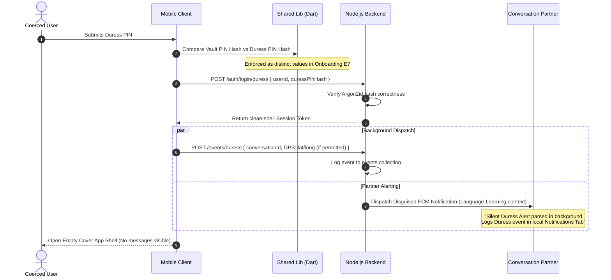
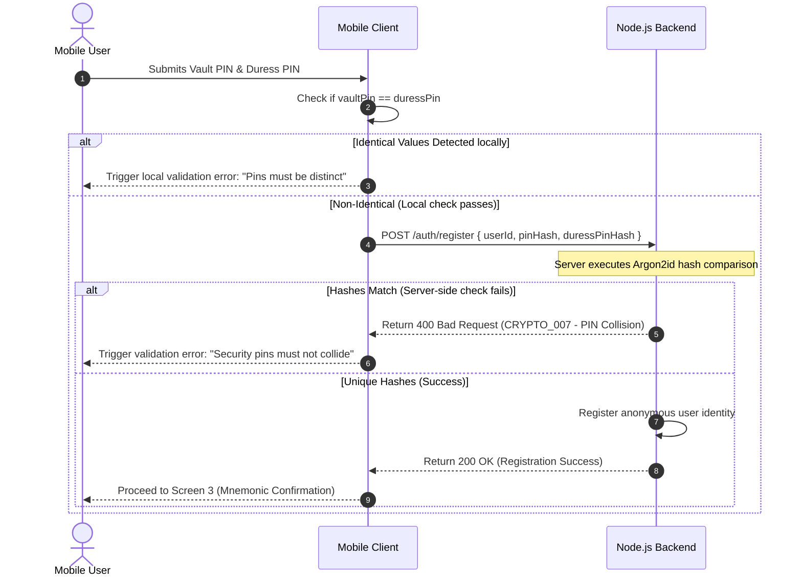
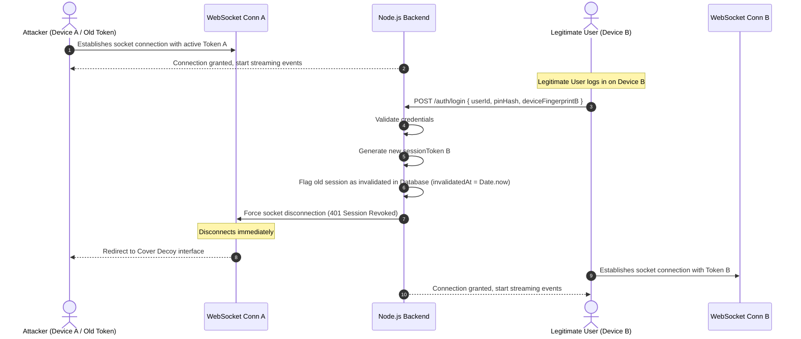

# Module Dependency Graph: Shared Cryptographic & Core Utilities



---

## 1. Normal Cryptographic Duality (Setup, Encryption, Decryption)

This sequence diagram illustrates the lifecycle of identity setup, room registration, message encryption, transport, and remote decryption.



---

## 2. Edge Case E11 — Wrong Key Wiping Flow

This diagram documents the error propagation and localized data destruction flow when a user attempts to decrypt with an incorrect or stale key (e.g. after a key rotation mismatch).



---

## 3. Duress PIN Activation Flow

This diagram illustrates the stealth execution triggered by entering the Duress PIN instead of the Vault PIN. The UI displays a seemingly empty vault shell, while cryptographically executing background notifications.



---

## 4. Edge Case E7 — PIN Collision Prevention Flow

This diagram shows how the system prevents the setup of identical PINs during the onboarding phase.



---

## 5. Edge Case E13 — Session Hijack Detection & Instant Revocation

This diagram illustrates how logging in from a new device instantly revokes and disconnects a hijacked session on the old device.



---

## 6. Global Monorepo Cryptographic Consumer Architecture

This flowchart maps the architectural dependencies, illustrating how subsequent backend and mobile modules import and consume specific cryptographic layers inside `modules/shared/`.

```mermaid
graph TD
    classDef default fill:#111,stroke:#333,stroke-width:1px,color:#eee;
    classDef shared fill:#1a3a2a,stroke:#2b664c,stroke-width:2px,color:#eee;
    classDef backend fill:#1a2b3c,stroke:#2c5b8f,stroke-width:1px,color:#eee;
    classDef mobile fill:#3c2a1a,stroke:#8f5c2c,stroke-width:1px,color:#eee;

    subgraph shared_module ["modules/shared/ (Core Library)"]
        node_lib["node/ (Mongoose / Express helpers)"]:::shared
        dart_lib["dart/ (Flutter FFI libsodium)"]:::shared
    end

    subgraph backend_modules ["modules/backend/"]
        b_auth["auth/ (Identity & PIN)"]:::backend
        b_dev["dev/ (Dev shadow)"]:::backend
        b_msg["messaging/ (WebSocket Hub)"]:::backend
        b_loc["location/ (Discrete Pings)"]:::backend
        b_rest["restoration/ (Inactivity Escape)"]:::backend
    end

    subgraph mobile_modules ["modules/mobile/"]
        m_vault["vault-auth/ (Vault Trigger)"]:::mobile
        m_msg["messaging/ (Decrypt/Encrypt bubbles)"]:::mobile
        m_notes["notes/ (Notebook MD editor)"]:::mobile
        m_loc["location/ (Background trigger)"]:::mobile
        m_rest["restoration/ (Recovery recovery)"]:::mobile
        m_sett["settings/ (PIN rotate/wipe)"]:::mobile
    end

    %% Backend Dependencies
    b_auth -->|Imports hash/verifyPin| node_lib
    b_auth -->|Imports timingSafeVerify| node_lib
    b_dev -->|Encrypts credential shadow| node_lib
    b_msg -->|Verifies socket AAD bindings| node_lib
    b_loc -->|Validates ping payloads| node_lib
    b_rest -->|Validates PBKDF2 mnemonics| node_lib

    %% Mobile Dependencies
    m_vault -->|Derives vaultKey via Argon2id| dart_lib
    m_vault -->|Generates random salt| dart_lib
    m_msg -->|Derives messages subkey (ID=1)| dart_lib
    m_msg -->|Encrypts/Decrypts ChaCha20-Poly1305| dart_lib
    m_notes -->|Derives notes subkey (ID=2)| dart_lib
    m_notes -->|Encrypts note titles & content| dart_lib
    m_loc -->|Derives media subkey (ID=3)| dart_lib
    m_loc -->|Encrypts lat/long pings| dart_lib
    m_rest -->|Generates BIP-39 mnemonic| dart_lib
    m_rest -->|Derives restoration index checks| dart_lib
    m_sett -->|Handles wipes and key rotations| dart_lib
```